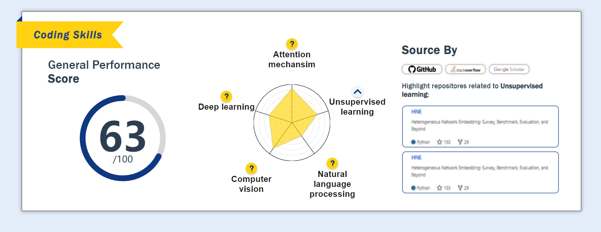
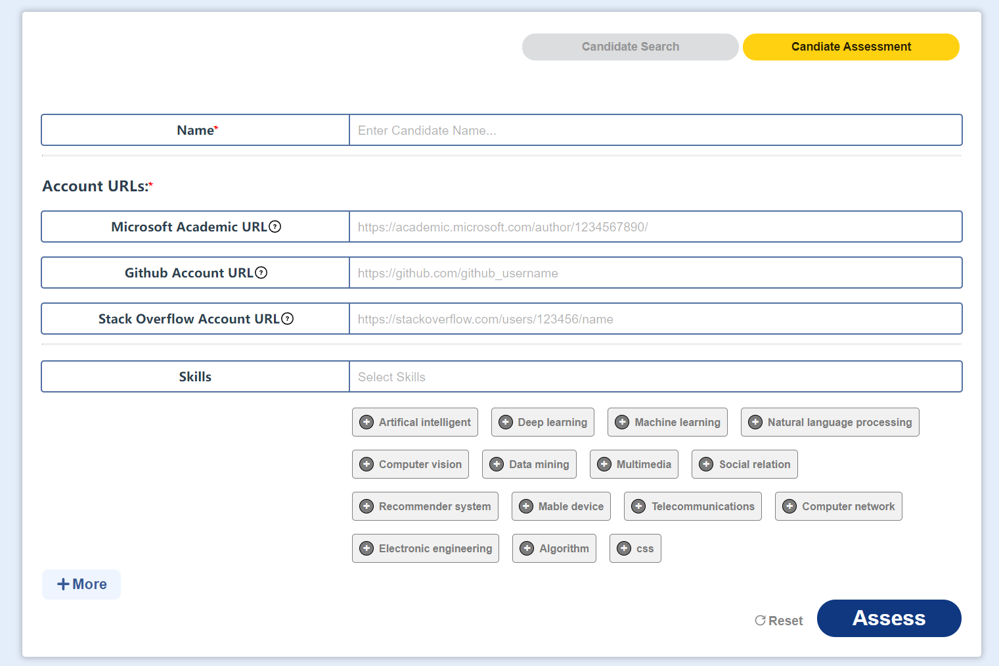

# Skill Card Demo

Frontend Coding Test

Display skill card and input page




## Project setup
```
cd dev-server
npm install
npm start
```

## API example
please view the file /src/api.js for detail

Detail of the user for skill card
```
// METHOD POST
fetchSkills({
    skill_names: ["Skill Name"], 
    account_info: [["academic","id"], ["stackoverflow", "id"], ["github", "id"]], 
    appid: "id"
})
```

Post new assessment
```
// METHOD POST
postAssess({
    name: 'Yunu Jung',
    microsoftAcademic: 'https://xxxxxxx.com',
    github: 'https://xxxxxxx.com',
    stackOverflow: 'https://xxxxxxx.com',
    skills: 'Programing, Reading'
})
```

### Compiles and hot-reloads for development
```
npm run serve
```

### Compiles and minifies for production
```
npm run build
```

### Lints and fixes files
```
npm run lint
```

### Customize configuration
See [Configuration Reference](https://cli.vuejs.org/config/).
